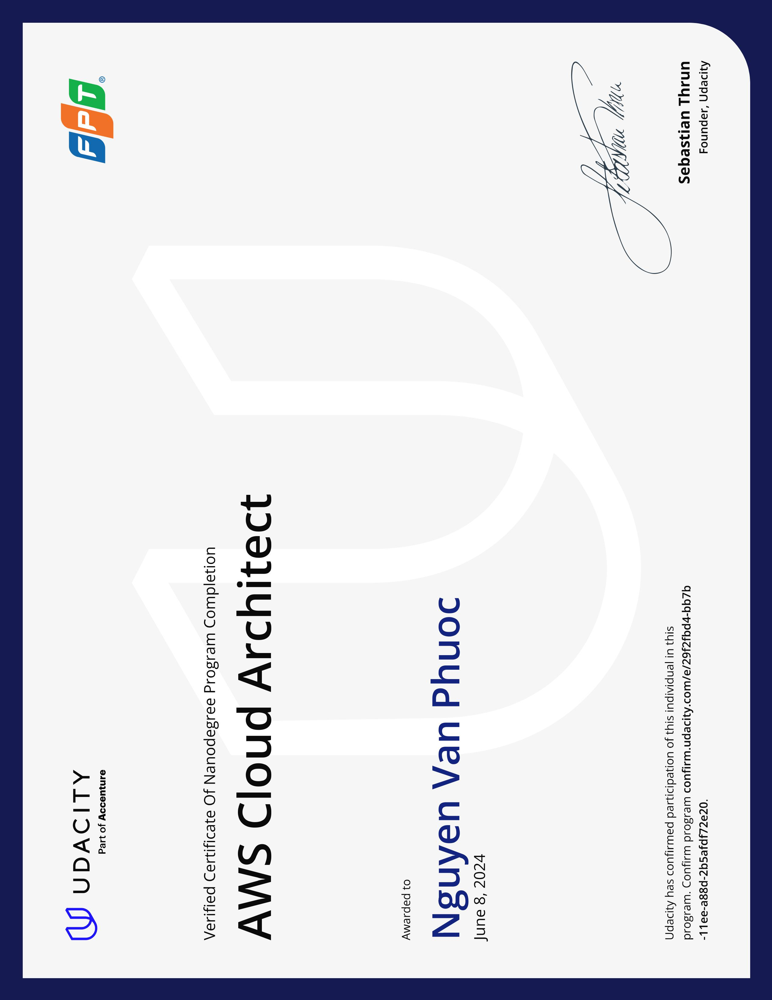

# AWS Cloud Architect

The AWS Cloud Architect program focuses on designing highly available, reliable, and resilient systems and networks using AWS infrastructure. It covers availability zones, regions, building for resiliency, business objectives, security, monitoring, reacting, and recovering. Learners will also understand the differences between traditional data centers and cloud infrastructure and how to design, provision, and monitor infrastructure using open-source tools. Additionally, the program covers cost and monitoring, high performance, servers and security groups, storage and databases, and securing access to cloud services and infrastructure. Throughout the program, learners will practice designing for performance and scalability, recovering from failure, and securing cloud infrastructure.

## Design for Availability, Reliability, and Resiliency

In this course, you will learn to use AWS to create highly available and resilient systems and networks.

## Design for Performance and Scalability

In this course, you will use AWS tools to identify and implement best practices for cost and identify and understand the elements required to design and architect scalable infrastructure. You will be able to modify traditional infrastructure for performance and identify architectures and workloads where serverless infrastructure should be considered to meet cost and performance goals. Finally, you will be able to provision and destroy infrastructure from the command line using the AWS CLI and Terraform.

## Design for Security

In this course, you will explore best practices and strategies around securing access to cloud services and infrastructure. You will also use tools and methods available with AWS to ensure that data stored in the cloud is protected. Finally, you will investigate security practices around monitoring and defending cloud-based applications and environments.

## Certificate

- 
