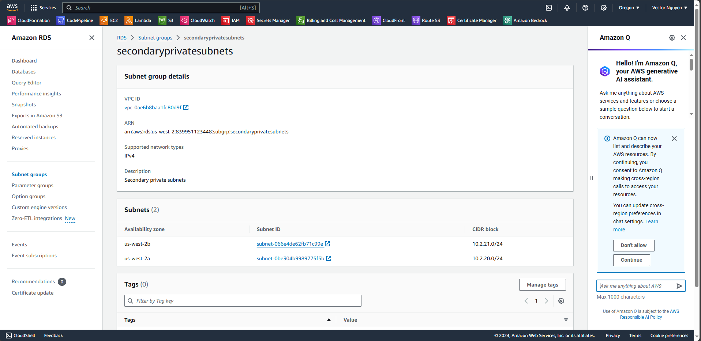
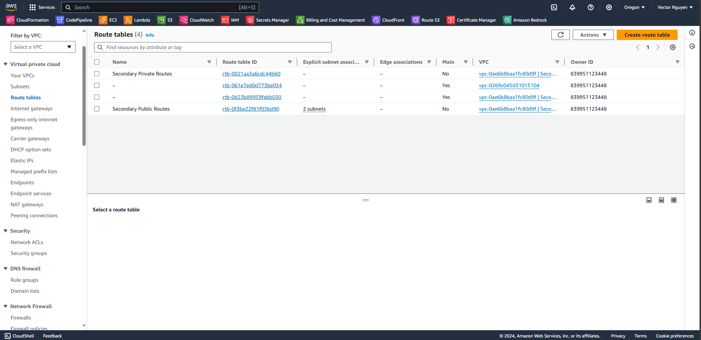
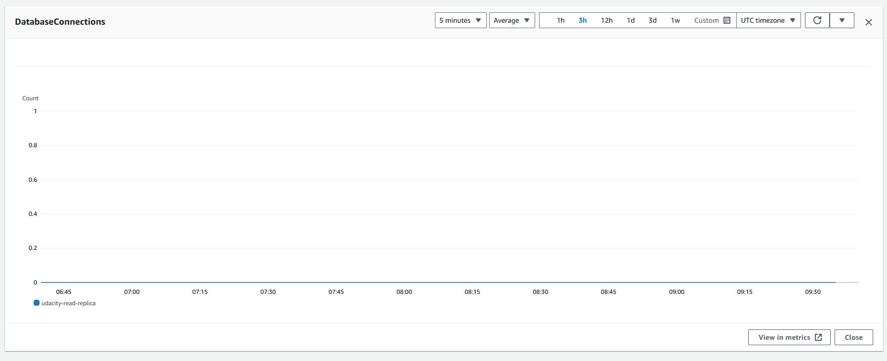
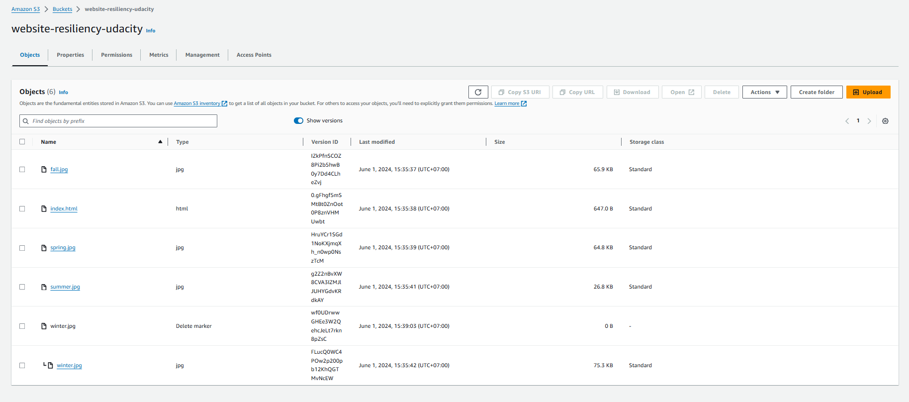

# Data Durability and Recovery

In this project, you will create highly available solutions to common use cases. You will build a Multi-Availability Zone, Multi-Region database and demonstrate how to use it in multiple geographically separate AWS regions. Additionally, you will create a website hosting solution that is versioned to quickly and easily undo any data destruction and accidents.

## Table of Contents

1. [Getting Started](#getting-started)
2. [Project Instructions](#project-instructions)
   - [CloudFormation](#cloudformation)
   - [Part 1: Data Durability and Recovery](#part-1-data-durability-and-recovery)
     - [Highly Durable RDS Database](#highly-durable-rds-database)
     - [Estimate Availability of Configuration](#estimate-availability-of-configuration)
     - [Demonstrate Normal Usage](#demonstrate-normal-usage)
     - [Monitor Database](#monitor-database)
   - [Part 2: Failover and Recovery](#part-2-failover-and-recovery)
   - [Part 3: Website Resiliency](#part-3-website-resiliency)
3. [Architecture Diagram](#architecture-diagram)

## Getting Started

To get started, clone this repo. Aside from instructions, it contains a CloudFormation script to build an AWS VPC with public and private subnets. It also contains an example website that you will host in an AWS S3 bucket in your account.

```
├── README.md
├── cloudformation
│   └── vpc.yaml
├── s3
│   ├── fall.jpg
│   ├── index.html
│   ├── spring.jpg
│   ├── summer.jpg
│   └── winter.jpg
├── screenshots
│   ├── cloudformationCreate.png
│   ├── primary_Vpc.png
│   ├── secondary_Vpc.png
│   ├── primaryDB_config.png
│   ├── secondaryDB_config.png
│   ├── primaryDB_subnetgroup.png
│   ├── secondaryDB_subnetgroup.png
│   ├── primaryVPC_subnets.png
│   ├── secondaryVPC_subnets.png
│   ├── primary_subnet_routing.png
│   ├── secondary_subnet_routing.png
│   ├── monitoring_connections.png
│   ├── monitoring_replication.png
│   ├── rr_before_promotion.png
│   ├── rr_after_promotion.png
│   ├── s3_original.png
│   ├── s3_season.png
│   ├── s3_season_revert.png
│   ├── s3_deletion.png
│   └── s3_delete_marker.png
└── starter
    └── README.md
```

## Project Instructions

### CloudFormation

In this project, you will use AWS CloudFormation to create Virtual Private Clouds (VPCs). CloudFormation is an AWS service that allows you to create infrastructure as code. Here is the complete list of resources the YAML CloudFormation template will create for you:

- VPC
- Two private subnets
- Two public subnets
- Route tables for public and private subnets, and associate the route tables with the subnets
- Two security groups, one for the application and another for the database
- An Internet Gateway

The diagram below displays the overall architecture when you are done creating the VPC in two regions separately. The diagram assumes you will use `us-east-1` as Primary and `us-west-2` as Secondary (failover) region.


To build a VPC from the YAML file, follow these steps:

1. Go to AWS Services -> CloudFormation
2. Create stack “With new resources (standard)”
   
3. Select "Template is ready"
4. Upload a template file
5. Click “Choose file” button and select the provided YAML file
6. Click "Next"
7. Fill in the Stack name, e.g., `cd1908-project-stack` for the Primary and `cd1908-project-stack-secondary` for the Secondary stack
8. Name the VPCs as "Primary" and "Secondary" respectively
9. Update the CIDR blocks to match the architecture diagram above (only needed for the secondary region)
10. Click "Next"
11. Click "Next" again
12. Click "Create stack"
13. Wait for the stack to build out and refresh until the status becomes “CREATE_COMPLETE”
14. Observe the “Outputs” tab for the created IDs which will be used later

### Part 1: Data Durability and Recovery

To achieve high levels of durability and availability in AWS, take advantage of multiple AWS regions.

1. Pick two AWS regions: an active region and a standby region.
2. Use CloudFormation to create one VPC in each region. Name the VPC in the active region "Primary" and in the standby region "Secondary".

**Note**: Be sure to use different CIDR address ranges for the VPCs.

Save screenshots of both VPCs after creation:

- 
- 

#### Highly Durable RDS Database

1. Create a new RDS Subnet group in both the active and standby regions.
2. Create a new MySQL, multi-AZ database in the active region with the following configurations:
   - Use a “burstable” instance class
   - Attach only the “UDARR-Database” security group
   - Create an initial database named “udacity”
3. Create a read replica database in the standby region with the same configurations as the database in the active region.

Save screenshots of the configurations:

- 
- 
- 
- 
- 
- 
- 
- 

#### Estimating Availability

Estimate the achievable Recovery Time Objective (RTO) and Recovery Point Objective (RPO) for this Multi-AZ, multi-region database in terms of:

1. Minimum RTO for a single AZ outage
2. Minimum RTO for a single region outage
3. Minimum RPO for a single AZ outage
4. Minimum RPO for a single region outage

Save your answers in a text file named `estimates.txt`.

#### Demonstrate Normal Usage

In the active region:

1. Create an EC2 key pair in the region.
2. Launch an Amazon Linux EC2 instance in the active region, configuring it to use the VPC's public subnet and security group ("UDARR-Application").
3. SSH to the instance and connect to the "udacity" database in the RDS instance.
4. Verify that you can create a table, insert data, and read data from the database.

Save the log of these operations in a text file called `log_primary.txt`.

#### Monitoring

1. Observe the “DB Connections” to the database and how this metric changes as you connect to the database.
2. Observe the “Replication” configuration with your multi-region read replica.

Save screenshots of the monitoring:

- 
- 

### Part 2: Failover and Recovery

In the standby region:

1. Create an EC2 key pair in the region.
2. Launch an Amazon Linux EC2 instance in the standby region, configuring it to use the VPC's public subnet and security group ("UDARR-Application").
3. SSH to the instance and connect to the read replica database.
4. Verify that you cannot insert data into the database but can read from it.

Save the log of these operations in a text file called `log_rr_before_promotion.txt`.

Save a screenshot of the database configuration before promotion:

- 

5. Promote the read replica.
6. Verify that you can insert data into and read from the promoted database in the standby region.

Save the log of these operations in a text file named `log_rr_after_promotion.txt`.

Save a screenshot of the database configuration after promotion:

- 

### Part 3: Website Resiliency

Create a resilient static web hosting solution in AWS. Create a versioned S3 bucket and configure it as a static website.

1. Enter “index.html” for both Index document and Error document.
2. Upload the files from the GitHub repo (`/project/s3/`).
3. Paste the URL into a web browser to see your website.

Save a screenshot of the webpage:

- 

**Accidental Changes and Recovery**

1. Change `index.html` to refer to a different “season”.
2. Re-upload `index.html` and refresh the webpage.

Save a screenshot of the modified webpage:

- 

Recover the website by rolling back to the previous version.

1. Recover the `index.html` object back to the original version

. 2. Refresh the webpage.

Save a screenshot of the reverted webpage:

- 

**Accidental Deletion and Recovery**

1. Delete “winter.jpg”.

Save screenshots of the modified webpage and the existing versions of the file showing the "Deletion marker":

- 
- 

Recover the deleted object.

1. Recover the deleted object.
2. Refresh the webpage.

Save a screenshot of the recovered webpage:

- 
