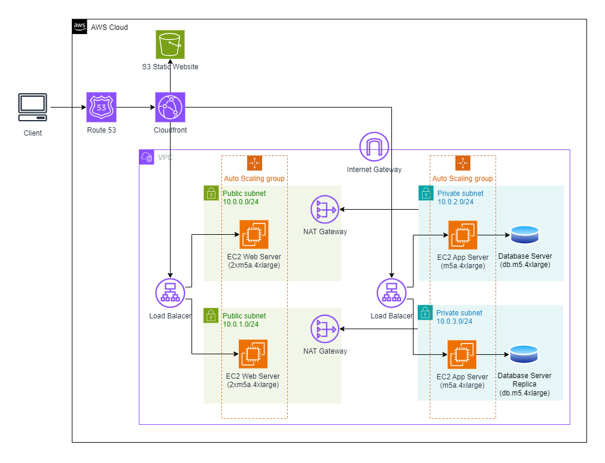

# Design, Provision, and Monitor AWS Infrastructure at Scale

## Table of Contents

1. [Project Overview](#project-overview)
2. [Design Infrastructure Solution](#design-infrastructure-solution)
   - [Part 1: Cost-effective AWS Infrastructure](#part-1-cost-effective-aws-infrastructure)
   - [Part 2: Serverless Architecture](#part-2-serverless-architecture)
3. [Estimate Costs](#estimate-costs)
   - [Initial Budget Scenario](#initial-budget-scenario)
   - [Reduced Budget Scenario](#reduced-budget-scenario)
   - [Increased Budget Scenario](#increased-budget-scenario)
4. [Infrastructure as Code](#infrastructure-as-code)
   - [Part 1: Provision EC2 Instances](#part-1-provision-ec2-instances)
   - [Part 2: Deploy AWS Lambda Function](#part-2-deploy-aws-lambda-function)
5. [Conclusion](#conclusion)

## Project Overview

In this project, I will plan, design, provision, and monitor infrastructure in AWS using industry-standard and open-source tools. I will practice the skills I have learned throughout the course to optimize infrastructure for cost and performance. I will also use Terraform to provision and configure AWS services in a global configuration.

## Design Infrastructure Solution

### Part 1: Cost-effective AWS Infrastructure

I have been asked to plan and provision a cost-effective AWS infrastructure for a new social media application development project for 50,000 single-region users. The project requires the following AWS infrastructure and services:

- Region: us-east-1
- A user/client machine
- One VPC
- Two Availability Zones
- Four Subnets (2 Public, 2 Private)
- A NAT Gateway
- A CloudFront distribution with an S3 Bucket
- Web servers in the Public Subnets
- Application Servers in the Private Subnets
- DB Servers in the Private Subnets
- Web Servers are Load Balanced and Autoscaled
- Application Servers are Load Balanced and Autoscaled
- A Master DB in AZ 1 with a read replica in AZ2

 
<em>Udacity_Diagram_1</em>

### Part 2: Serverless Architecture

I have been asked to plan a SERVERLESS architecture schematic for a new application development project. The project requires the following AWS infrastructure and services:

- A user/client machine
- AWS Route 53
- A CloudFront Distribution
- AWS Cognito
- AWS Lambda
- API Gateway
- DynamoDB
- S3 Storage

 
<em>Udacity_Diagram_2</em>

## Estimate Costs

I need to provide three versions of the pricing calculation for three different budgets. For each calculation, I will use the correct region (us-east-1), and not remove any part that would break the infrastructure. I can change the server types according to the budgets.

In all three cases, I will use the [AWS Pricing Calculator](https://calculator.aws/#/).

### Initial Budget Scenario

I will estimate how much it will cost to run the services in my Part 1 diagram for one month. My target is a monthly estimate between $8,000-$10,000. I will export the estimate as a CSV file named `Initial_Cost_Estimate.csv`.

### Reduced Budget Scenario

I will target a monthly estimate of a maximum of $6,500. I will think about what part(s) I could remove or reduce. I will export the estimate as a CSV file named `Reduced_Cost_Estimate.csv` and write at least 3 sentences explaining which services were changed or removed.

### Increased Budget Scenario

I will target a monthly estimate of a maximum of $20,000. I will think about adding redundancy and improving performance. I will export the estimate as a CSV file named `Increased_Cost_Estimate.csv` and write at least 3 sentences explaining which services were changed, removed, or added.

## Infrastructure as Code

### Part 1: Provision EC2 Instances

1. Download the [starter code](https://github.com/udacity/cand-c2-project).
2. In the `main.tf` file, I will write the code to provision:
   - AWS as the cloud provider
   - Use an existing VPC ID
   - Use an existing public subnet
   - 4 AWS t2.micro EC2 instances named "Udacity T2"
   - 2 m4.large EC2 instances named "Udacity M4"
3. I will run Terraform.
4. I will take a screenshot of the 6 EC2 instances in the AWS console and save it as `Terraform_1_1.png`.
5. I will use Terraform to delete the 2 m4.large instances.
6. I will take an updated screenshot of the AWS console showing only the 4 t2.micro instances and save it as `Terraform_1_2.png`.

 
<em>Terraform_1_1</em>

 
<em>Terraform_1_2</em>

### Part 2: Deploy AWS Lambda Function

1. In the `Exercise_2` folder, I will write the code to deploy an AWS Lambda Function using Terraform. My code will include:
   - A `lambda.py` file
   - A `main.tf` file with AWS as the provider, an IAM role for Lambda, a VPC, and a public subnet
   - An `outputs.tf` file
   - A `variables.tf` file with an AWS region
2. I will take a screenshot of the EC2 instances page.
3. I will take a screenshot of the VPC page.

 
<em>Terraform_2_1</em>

## Conclusion

In this project, I have designed, provisioned, and monitored AWS infrastructure at scale using both traditional and serverless architectures. I have practiced estimating costs for different budget scenarios and utilized Terraform to automate the provisioning of AWS services. This comprehensive approach ensures cost-effective and scalable infrastructure management in AWS.
